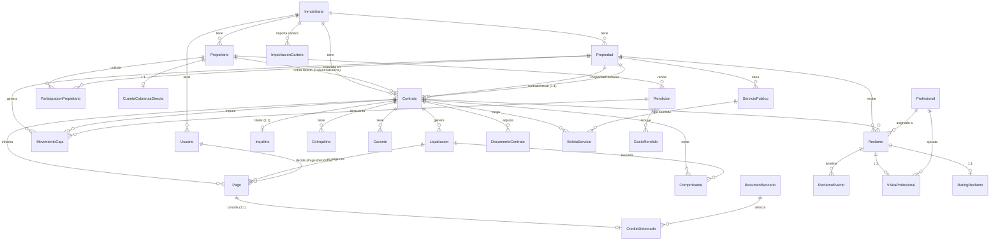

# Modelo de datos — My Alquiler

> ERD de los modelos core, comportamiento `onDelete` de las FK (clave: ¡ninguna
> declara `onDelete`! → defaults RESTRICT/SetNull) y scoping multi-tenant. 75 modelos,
> 74 enums, ~2330 líneas en `apps/api/prisma/schema.prisma`.
>
> Actualizado 2026-07-04 (HEAD `535d15d`, árbol limpio). Última migración:
> `20260703110000_avatar_credito_importacion` — avatar del inquilino, conciliación de
> créditos detectados y migración de cartera. Demo intacta / ambos modos andan.

---

## Modelo de datos

El esquema vive en `apps/api/prisma/schema.prisma` (~2330 líneas, 75 modelos, Postgres). El núcleo gira alrededor de tres ejes: **propiedad/propietarios** (quién es dueño y cómo se le rinde), **contrato/personas** (titular, co-inquilinos, garantes) y **cobranza** (liquidaciones → pagos → comprobantes, más caja y rendiciones). Todo está particionado por `inmobiliariaId` (multi-tenant).

### Diagrama de entidades (CORE)

Notas de cardinalidad relevantes:
- `Propiedad ↔ Contrato` tiene **dos relaciones distintas**: `PropiedadContratos` (histórico, 1:N) y `ContratoActual` (1:1 vía `Propiedad.contratoActualId @unique`).
- `Inquilino`, `IntencionRenovacion`, `CuentaCobranzaDirecta`, `ArcaConfig`, `VisitaProfesional`, `RatingReclamo`, `ConfirmacionReclamo` y `CargoPagado` son **1:1** (su FK al padre lleva `@unique`).
- `Pago ↔ CreditoDetectado` es **1:1 opcional**: `CreditoDetectado.pagoId` es `String? @unique` (lado `pago Pago?`), y en `Pago` la back-relation es `creditoDetectado CreditoDetectado?`. Cuando el validador de resumen bancario concilia un crédito, crea el `Pago` y lo linkea 1:1 (ver conciliación abajo). Un crédito sin conciliar tiene `pagoId = null`.
- `ParticipacionPropietario` es la tabla puente de cotitularidad, con PK compuesta `@@id([propiedadId, propietarioId])`.

### Comportamiento onDelete de las FK clave

**Hallazgo central: el esquema NO declara `onDelete` en ninguna relación.** Por lo tanto Prisma aplica sus defaults, que difieren según el campo escalar de la FK sea obligatorio u opcional:

- FK **requerida** (ej. `String`) → `onDelete: Restrict` (Postgres `NO ACTION`). Borrar el padre **falla** si hay hijos.
- FK **opcional** (ej. `String?`) → `onDelete: SetNull`. Borrar el padre deja el hijo huérfano con la FK en `null`.

Esto es exactamente lo que causó bugs reales: no se puede borrar un `Contrato`/`Propiedad`/`Propietario` mientras tenga hijos, porque casi todas las FK hijas son requeridas y quedan en RESTRICT por default.

| Relación (hijo → padre) | Campo FK | onDelete efectivo | Efecto al borrar el padre |
|---|---|---|---|
| `Liquidacion.contratoId → Contrato` | requerido | RESTRICT | bloquea borrar el contrato |
| `Pago.contratoId / liquidacionId` | requerido | RESTRICT | bloquea |
| `Comprobante.contratoId` | requerido | RESTRICT | bloquea |
| `Garante.contratoId → Contrato` | requerido | RESTRICT | bloquea |
| `CoInquilino.contratoId → Contrato` | requerido | RESTRICT | bloquea |
| `Reclamo.contratoId → Contrato` | requerido | RESTRICT | bloquea |
| `ParticipacionPropietario.propiedadId / propietarioId` | requerido | RESTRICT | bloquea borrar propiedad/propietario |
| `MovimientoCaja.propiedadId → Propiedad` | requerido | RESTRICT | bloquea |
| `Contrato.propiedadId → Propiedad` | requerido | RESTRICT | bloquea borrar la propiedad |
| `GastoRendido.rendicionId → Rendicion` | requerido | RESTRICT | bloquea |
| `ServicioPublico.propiedadId → Propiedad` | requerido | RESTRICT | bloquea |
| `BoletaServicio.contratoId → Contrato` | requerido | RESTRICT | bloquea |
| `ReclamoEvento.reclamoId → Reclamo` | requerido | RESTRICT | bloquea |
| `VisitaProfesional.reclamoId / profesionalId` | requerido | RESTRICT | bloquea |
| `ImportacionCartera.inmobiliariaId → Inmobiliaria` | requerido | RESTRICT | bloquea borrar la inmobiliaria si tiene importaciones (la migración lo declara explícito: `ON DELETE RESTRICT`) |
| `CreditoDetectado.pagoId → Pago` | **opcional** (`String? @unique`) | SetNull | borrar el `Pago` no borra el crédito; solo nulifica `pagoId` (la migración lo declara explícito: `ON DELETE SET NULL`) |
| `Inquilino.contratoId → Contrato` | **opcional** (`String?`) | SetNull | el inquilino queda con `contratoId = null` |
| `Contrato.contratoActualId` (en `Propiedad`) | **opcional** | SetNull | la propiedad pierde el puntero a su contrato actual |
| `MovimientoCaja.contratoId / rendicionId` | **opcional** | SetNull | el movimiento se desliga |
| `Reclamo.propiedadId / profesionalId` | **opcional** | SetNull | el reclamo pierde la atribución |
| `Contrato.cobraDirectoPropietarioId` | **opcional** | SetNull | el contrato pierde el propietario de cobranza directa |
| `Pago.decididoPorId → Usuario` | **opcional** | SetNull | el pago conserva la decisión sin autor |

Implicación práctica: el borrado de entidades CORE requiere cascada manual en la capa de servicio (borrar hijos en orden) o soft-delete; un `delete` directo sobre un `Contrato`/`Propiedad`/`Propietario` con dependientes tira error de FK.

### Scoping multi-tenant e índices/unique clave

**Multi-tenant.** Cada modelo (salvo catálogos globales como `Capacidad`) lleva `inmobiliariaId` con `@relation` a `Inmobiliaria` y un `@@index([inmobiliariaId])` (o índice compuesto, ej. `@@index([inmobiliariaId, estado])` en `Contrato`/`Pago`/`Reclamo`/`Screening`). El aislamiento de datos es por aplicación (los guards de `apps/api/src/auth/guards.ts` filtran por `inmobiliariaId`); la base no fuerza Row-Level Security, así que el scoping es responsabilidad de las queries.

**Unique compuestos que codifican reglas de negocio:**
- `CoInquilino @@unique([contratoId, email])` — una sola invitación por (contrato, email). La revocación **borra** la fila para que re-invitar no choque (cierra la carrera de doble-invitación).
- `ServicioPublico @@unique([propiedadId, tipo])` — un registro por servicio por propiedad (upsert por `propiedad+tipo`).
- `Liquidacion @@unique([contratoId, periodo])` — una liquidación por contrato por mes.
- `Rendicion @@unique([propietarioId, periodo])` y `CierreCaja @@unique([inmobiliariaId, fecha])` — snapshots únicos por período/día.
- `Usuario @@unique([inmobiliariaId, email])` e `Inquilino @@unique([inmobiliariaId, email])` — email único **dentro del tenant** a nivel DB. **OJO:** el login y el alta de usuario lo tratan como **global** a nivel app (buscan por email sin `inmobiliariaId`), así dos inmobiliarias no comparten email de usuario. Ver `../SECURITY.md`.
- `AnuncioAcuse @@unique([anuncioId, inquilinoId])` — un acuse por inquilino por anuncio.
- Relaciones 1:1 vía `@unique` en la FK: `Inquilino.contratoId`, `IntencionRenovacion.contratoId`, `ArcaConfig.propietarioId`, `CuentaCobranzaDirecta.propietarioId`, `Propiedad.contratoActualId`, `VisitaProfesional.reclamoId`, `RatingReclamo.reclamoId`, `CargoPagado.reclamoId`, `DatosBancarios.inmobiliariaId`.

**Índice único parcial (fuera de Prisma).** El modelo `Pago` documenta un índice `pagos_liquidacionId_informado_key` sobre `(liquidacionId) WHERE estado='INFORMADO'`, creado a mano en la migración `20260621000000_audit_unique_constraints`. Garantiza **un solo pago en estado `INFORMADO` por liquidación**. Prisma no expresa índices parciales, así que `prisma migrate dev` puede reportar "drift" sobre `pagos`: es esperado y **no debe borrarse**.

### Novedades del schema (migración `20260703110000_avatar_credito_importacion`)

Bundle de 3 features de la auditoría de archivos/adjuntos (avatar del inquilino, conciliación de créditos del validador de resumen bancario, y migración de cartera). Aplicada en prod el 2026-07-04 (la API booteó healthy con el schema nuevo). Demo intacta / ambos modos andan.

**`Inquilino.imageUrl String?`** — avatar (foto de perfil en `/uploads` del tenant), mismo patrón que `Usuario.imageUrl`. Único `ALTER TABLE` sobre `inquilinos` de esta migración. Lo consume `PUT /mis-datos/avatar` (app inquilino).

**`CreditoDetectado` — conciliación 1:1 con `Pago`.** Se agregan dos campos:
- `conciliado Boolean @default(false)` — marca el crédito como ya conciliado (creó un `Pago` real) para no reconciliar dos veces la misma línea del extracto.
- `pagoId String? @unique` + `pago Pago?` — link 1:1 opcional al `Pago` creado. Back-relation en `Pago`: `creditoDetectado CreditoDetectado?`.

Al conciliar (`POST /resumenes-bancarios/:id/creditos/:creditoId/conciliar`, con PIN) se crea un `Pago` **directo CONCILIADO** (TRANSFERENCIA, no pasa por `INFORMADO` porque lo detectó el banco) y se linkea vía `pagoId`. Lock atómico anti doble-conciliación: `updateMany where conciliado:false`. FK `pagoId → pagos(id)` con **`ON DELETE SET NULL`** (borrar el `Pago` no borra el crédito).

**`ImportacionCartera` — modelo nuevo** (`@@map("importaciones_cartera")`). Es el backend real de la **migración de cartera**: el dueño sube SU propia planilla (Excel/CSV) y mapea qué columna es qué (mapeo flexible, sinónimos auto-sugeridos; no hay formato fijo impuesto). Campos: `archivoUrl`, `nombreArchivo`, `columnas Json` (headers en orden), `filas Json` (filas crudas parseadas), `mapeoColumnas Json?` (`{ campoDestino: columnaOrigen }` una vez mapeado), `totalFilas Int`, `estado EstadoImportacion @default(SUBIDO)`, `resultado Json?` (`{ creadas, errores:[{fila,motivo}] }`), `creadoPor`, timestamps. Relación a `Inmobiliaria` vía `inmobiliariaId` con `@@index([inmobiliariaId])`; FK con **`ON DELETE RESTRICT`** (no se puede borrar la inmobiliaria si tiene importaciones).

**`enum EstadoImportacion { SUBIDO MAPEADO CONFIRMADO }`** — máquina de estados de la importación:
- `SUBIDO` — archivo parseado, esperando mapeo de columnas.
- `MAPEADO` — mapeo confirmado, esperando confirmar el import.
- `CONFIRMADO` — filas procesadas (ver `resultado`).

**Columnas que YA existían (NO son de esta migración).** `Usuario.imageUrl String?`, `MovimientoCaja.comprobanteUrl String?` y `Pago.comprobanteUrl String?` vienen todas de la migración base `20260612042420_nucleo_completo`, no de `20260703110000`. `PUT /me/avatar` y el comprobante de gasto de caja usan esas columnas preexistentes → **sin migración**. ⚠️ **OJO (backend-ready sin UI):** el `POST /caja/movimientos` ya valida y persiste `comprobanteUrl` (se arregló 04/07 un bug donde el `create` lo validaba pero no lo guardaba), pero el front del panel todavía NO consume el avatar propio del usuario ni sube el comprobante en el alta de gasto de caja. Ver `../API.md`.

